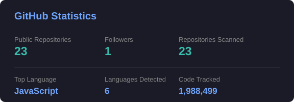
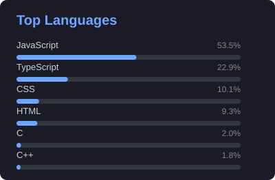

<div align="center">


<a href="https://readme-typing-svg.demolab.com">

</a>

<br />

<a href="https://www.aitr.ac.in/"></a>
<a href="https://anikesh-portfolio-seven.vercel.app/"></a>
<a href="https://www.linkedin.com/in/anikeshjain/"></a>
<a href="mailto:anikeshjainxtech@gmail.com"></a>
<a href="https://github.com/Anikesh-Jain"></a>

<br /><br />


</div>

---

## 👨‍💻 About Me

I'm **Anikesh Jain**, a B.Tech CSE student at **Acropolis Institute of Technology and Research (AITR), Indore**, focused on becoming a professional **Full-Stack MERN Developer**.

I enjoy building practical web products rather than stopping at tutorials — from authentication and REST APIs to databases, dashboards, analytics, deployment, and polished user interfaces.

- 🚀 Focused on **Full-Stack Web Development & MERN**
- 🧩 Interested in building **real-world, production-ready applications**
- 🎨 Combining **development with graphic design and creative problem-solving**
- 📚 Continuously strengthening my **frontend, backend, database, and software engineering fundamentals**
- 🌐 Portfolio: [anikesh-portfolio-seven.vercel.app](https://anikesh-portfolio-seven.vercel.app/)
- 📫 Email: **anikeshjainxtech@gmail.com**

---

## ⚡ Tech Stack

### Languages
<p></p>

### Frontend
<p></p>

### Backend
<p></p>

### Database
<p></p>

### Tools
<p></p>

---

## 🚀 Featured Projects

<details>
<summary><b>🛍️ Aura Store — Full-Stack E-Commerce Platform</b></summary>

<br />

A modern full-stack e-commerce platform with product management, authentication, cart and wishlist workflows, payments, media handling, email functionality, and production deployment.

- Authentication and role-based access
- Product, cart, wishlist, and order workflows
- Razorpay payment integration
- Cloudinary media handling
- Email functionality with Resend
- PostgreSQL with Prisma ORM
- Production deployment on Vercel

**Repository:** [github.com/Anikesh-Jain/aurastore](https://github.com/Anikesh-Jain/aurastore)  
**Live:** [aurastore-nu.vercel.app](https://aurastore-nu.vercel.app/)

</details>

<details>
<summary><b>💰 SmartExpense — Student Edition</b></summary>

<br />

A full-stack personal finance platform for transaction tracking, budgeting, savings planning, analytics, and multi-currency financial management.

- JWT authentication and user isolation
- Transactions, budgets, and savings goals
- Analytics and spending insights
- Multi-currency architecture
- CSV export and admin RBAC
- Security middleware and rate limiting
- Production deployment with Vercel, Render, and MongoDB Atlas

**Repository:** [github.com/Anikesh-Jain/smart-expense](https://github.com/Anikesh-Jain/smart-expense)  
**Live:** [smart-expense-blond.vercel.app](https://smart-expense-blond.vercel.app/)

</details>

<details>
<summary><b>🌐 Developer Portfolio</b></summary>

<br />

A modern developer portfolio rebuilt with a component-based React architecture, premium dark visual system, responsive layouts, animations, project showcases, and a production deployment workflow.

**Repository:** [github.com/Anikesh-Jain/anikesh-portfolio](https://github.com/Anikesh-Jain/anikesh-portfolio)  
**Live:** [anikesh-portfolio-seven.vercel.app](https://anikesh-portfolio-seven.vercel.app/)

</details>

---

## 📊 GitHub Analytics

<p align="center">

</p>

<p align="center">

</p>

<p align="center">

</p>

---

## 🏆 GitHub Trophies

<p align="center">

</p>

---

## 📈 Contribution Activity

<p align="center">

</p>

---

## 🐍 Contribution Snake

<p align="center">

</p>

---

## 🎯 Current Focus

```yaml
Learning:
  - Advanced MERN stack development
  - Backend architecture and API design
  - Database design and software engineering fundamentals

Building:
  - Production-ready full-stack applications
  - Portfolio-quality developer projects

Exploring:
  - Modern frontend architecture
  - Scalable backend patterns
  - Better developer workflows

Open To:
  - Full-stack development opportunities
  - Collaborative projects
  - Learning and building with other developers
```

---

## 🤝 Connect

<p align="center">
<a href="https://www.linkedin.com/in/anikeshjain/"></a>
<a href="mailto:anikeshjainxtech@gmail.com"></a>
<a href="https://github.com/Anikesh-Jain"></a>
<a href="https://anikesh-portfolio-seven.vercel.app/"></a>
</p>

---

<div align="center">

<i>Building. Learning. Improving. One commit at a time.</i>


</div>

